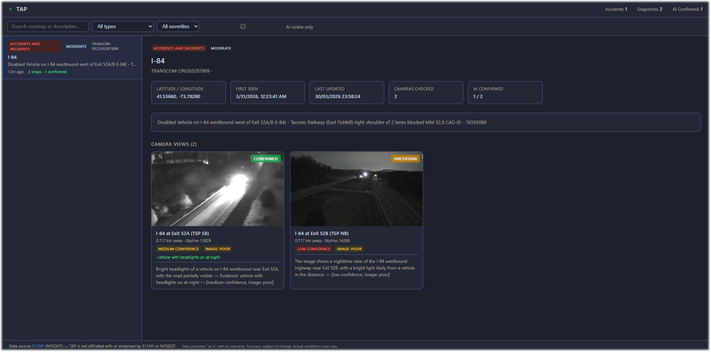

# 📸 TAP — Traffic Alert Photographer


> When an incident gets reported, TAP finds the nearest cameras, grabs a live frame, and asks AI whether it can actually see what's happening — then saves the whole thing as a record you can browse.

Currently covering **New York State** via the 511NY API, with expansion to additional states planned.

---



*The TAP web UI — incident list on the left, camera snapshots and AI analysis on the right.*

---

## Why TAP?

Most traffic incident systems give you text. TAP gives you a picture.

The gap between "incident reported" and "incident confirmed" is where a lot of time gets wasted — by journalists, researchers, and anyone else who needs to know what's *actually* happening on the road right now. TAP closes that gap automatically, pairing every structured event with a live camera view and an AI opinion on what it sees.

No manual camera-hunting. No stale screenshots. Just: incident in → visual record out.

---

## ✨ Features

- 🔄 **Continuous polling** — watches the 511NY API on a configurable interval
- 📍 **Proximity matching** — finds active cameras within a radius of each incident's coordinates
- 🎥 **Live capture** — grabs frames from MJPEG streams and HLS/M3U8 feeds via ffmpeg
- 🤖 **AI scene analysis** — OpenAI Vision assesses visibility with structured output: verdict, confidence, image quality, and specific evidence items
- 🗂️ **Incident records** — each incident gets its own directory with snapshots, a `report.json`, and a SQLite entry
- 🌐 **Built-in web UI** — browse, filter, and review incidents without touching the database
- ⚙️ **Fully configurable** — event type filters, radius, AI model, polling interval, all via `.env`

---

## 🔍 Potential Use Cases

TAP sits in a useful spot between raw event feeds and full traffic management platforms. Some things it's well-suited for:

- **Traffic & road safety research** — build a labeled dataset pairing incident metadata with real camera imagery for computer vision or congestion studies
- **Investigative journalism** — have visual evidence of a major incident ready before you even make the first call
- **Emergency management** — visual confirmation of road closures, flooding, or multi-vehicle accidents to support dispatch decisions
- **Infrastructure analysis** — build a long-term photographic record of problem corridors or recurring incident locations
- **ML training data** — generate paired (text, image) samples for fine-tuning vision models on real-world traffic scenes
- **Severe weather monitoring** — catch flash flooding, ice, or snow accumulation on roads as it happens

---

## How it Works

```
511NY API
    │
    ▼
new/updated event detected
    │
    ├─ find cameras within radius ──► skip if none
    │
    ├─ capture live frame (MJPEG / HLS / still fallback)
    │
    ├─ OpenAI Vision: is the incident visible?
    │       └─ verdict + confidence + evidence items
    │
    └─ save to incidents/<ID>/
            ├─ report.json
            └─ snap_<camera>.jpg
```

---

## 🚀 Quick Start

**Requirements:** Python 3.11+, Node.js 18+, `ffmpeg` on PATH, a [511NY developer API key](https://511ny.org/developers) *(free)*, and optionally an OpenAI API key.

```bash
git clone <repo> && cd TAP

# Backend
python -m venv .venv
source .venv/bin/activate      # Windows: .venv\Scripts\activate
pip install -r requirements.txt
cp .env.example .env
# set NY511_API_KEY — everything else has sensible defaults

# Frontend
cd web && npm install && npm run build && cd ..
```

```bash
python run.py
# → open http://localhost:5000
```

**Dev mode** (hot-reloading frontend):

```bash
# terminal 1 — backend
python run.py

# terminal 2 — frontend dev server (proxies /api/* to Flask)
cd web && npm run dev
# → open http://localhost:5173
```

To run the poller and web server as separate processes:

```bash
python -m tap.poller   # polling only
python -m tap.server   # web UI only
```

---

## ⚙️ Configuration

Everything lives in `.env`. See `.env.example` for the full list with comments.

| Variable | Default | Description |
|---|---|---|
| `NY511_API_KEY` | — | **Required.** Your 511NY developer key |
| `OPENAI_API_KEY` | — | Required if `OPENAI_ENABLED=true` |
| `NY511_POLL_INTERVAL` | `120` | Seconds between scans |
| `NY511_PROXIMITY_RADIUS_KM` | `1.0` | Camera search radius per event |
| `FILTER_EVENT_TYPES` | `accidentsAndIncidents,winterDrivingIndex` | Event types to process |
| `FILTER_SEVERITIES` | *(all)* | Severities to process |
| `OPENAI_ENABLED` | `true` | Set `false` to skip AI, just collect snapshots |
| `OPENAI_MODEL` | `gpt-4o` | Vision model |
| `OPENAI_MAX_IMAGE_DIM` | `1024` | Resize images before upload |
| `HOST` / `PORT` | `0.0.0.0` / `5000` | Web server bind |

**Event types:** `accidentsAndIncidents` · `roadwork` · `specialEvents` · `closures` · `transitMode` · `generalInfo` · `winterDrivingIndex`

---

## 📁 Output Format

```
incidents/
└── TRAVELIQ-1585/
    ├── report.json            ← full record: event data + per-camera AI results
    ├── snap_Skyline-5023.jpg  ← live frame at moment of detection
    └── snap_Skyline-5566.jpg
```

`report.json` looks like:

```json
{
  "incident_id": "TRAVELIQ-1585",
  "event_type": "accidentsAndIncidents",
  "severity": "Major",
  "roadway": "I-87 NB",
  "lat": 41.123, "lon": -73.881,
  "cameras": [
    {
      "name": "I-87 NB at Exit 7",
      "distance_km": 0.4,
      "snapshot": "snap_Skyline-5023.jpg",
      "ai_visible": true,
      "ai_confidence": "high",
      "ai_image_quality": "good",
      "ai_evidence": ["emergency vehicles on right shoulder", "lane closure visible"],
      "ai_summary": "Two fire trucks and a police cruiser visible on the right shoulder..."
    }
  ]
}
```

---

## 🗺️ Roadmap

- [x] New York State (511NY API)
- [ ] Multi-state expansion — additional state DOT APIs
- [ ] Webhook / push notifications for high-severity confirmed incidents
- [ ] Additional milestones to come...

If you're interested in adding support for another state's traffic API, open an issue — the client layer is designed to be straightforward to extend.

---

## 🤝 Contributing

See [CONTRIBUTING.md](CONTRIBUTING.md). The codebase is intentionally small — the full application is a single `tap/` package with eight focused modules.

---

## Data Source & Disclaimer

> **TAP is an independent open-source project. It is not affiliated with, endorsed by, or connected in any way to 511NY, the New York State Department of Transportation (NYSDOT), or any of their partner agencies.**

TAP uses the public [511NY](https://www.511NY.org) traffic data API. To use TAP you must obtain your own API key directly from 511NY and comply with the [511NY Developer's Access Agreement](https://511ny.org/developers/help) independently.

*The following disclaimer is reproduced from that agreement as required:*

> *Information availability and data accuracy are subject to change and may change as often as daily. Actual posted restrictions may be at variance with and supersede the information available from this data feed. 511NY, NYSDOT and their partner agencies make no warranty regarding provided data, whether express or implied, and all warranties of merchantability and fitness of provided data for any particular purpose are expressly disclaimed. Access to data is provided on an "as is" and "with all faults" basis.*

---

## License

Copyright (C) 2026 Dborasik — [GPL v3](LICENSE)

Free to use, modify, and distribute. Derivative works must remain open-source under GPL v3.
